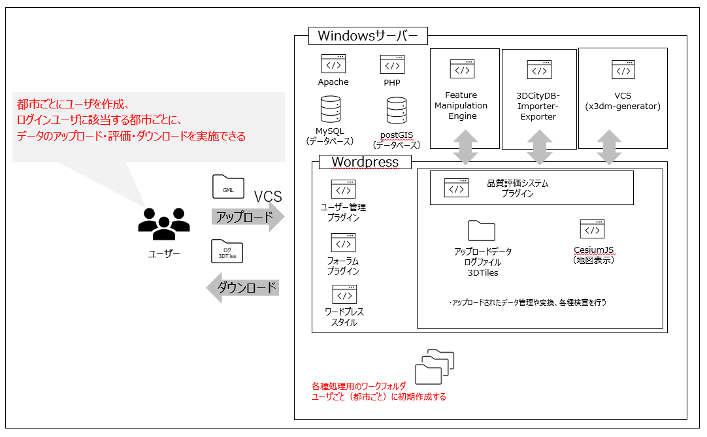

# 品質評価システム

## 概要

3D都市モデルの品質管理支援のための品質評価システム（Webポータル）です。

本ソフトウェアは、国土交通省の[Project PLATEAU](https://www.mlit.go.jp/plateau/)で開発され、3D都市モデルの品質管理支援に用いたWebポータルシステムです。対応データ形式は、内閣府地方創生推進事務局が定めた[i-都市再生技術仕様案 v2.0 (i-UR 2.0)](https://www.chisou.go.jp/tiiki/toshisaisei/itoshisaisei/iur/)に従い拡張された[OGC CityGML 2.0](https://www.ogc.org/standards/citygml)形式です。

なお、本ソフトウェアの動作には前提ソフトウェア（商用ソフトウェア）が必要で、単独では利用できません。Webポータルシステム構築の実装例として参考にして下さい。

ポータルから呼び出すCityGMLデータ検証機能の一部については、別リポジトリで提供します。

機能一覧
* データ登録、管理
* 書式・概念一貫性検証機能: https://github.com/Project-PLATEAU/CityGML-validation-function
* 位相一貫性検証機能: https://github.com/Project-PLATEAU/CityGML-geometry-validator
* 位置正確度検証
* ファイル配信
* 掲示板

## 動作環境、前提ソフトウェア

動作環境

* Windows (バッチファイル及びPowerShellスクリプト利用、Windows Server 2016 Datacenterで動作確認)

前提ソフトウェア

* Project PLATEAU関連ソフトウェア：位相一貫性検証機能
* 商用ソフトウェア：VC Publisher、VC Map、VC Database、FME Desktop
* OSS：Word Press 5.5、bbPress、PostgreSQL、PostGIS、MySQL Server、PHP、HTTPサーバ（Apache HTTP Serverなど）

## システム全体図

    
## 利用方法
1.	上記の前提ソフトウェアをインストールします。
1.	本レポジトリの一式をダウンロードしたものをWebサーバ、APサーバ、DBサーバに配置します。WebサーバではWordPress 5.5のディレクトリを上書きします。
1.	位相一貫性検証機能からダウンロードしたFME Workspace (*.fmw) をAPServer/batフォルダに配置します。
1.	ソース中の*****文字列を環境に合わせて置換します。
1.	DBServerフォルダ下のPG_CREATE_STATUS_TABLE.sqlをPostgreSQLのデータベースにSQLとして実行します。
1.	Webサーバの wp-login.php を開きます。

※ WordPressを利用する一部機能(メニュー、掲示板、ログイン制御、テーマ・スタイル等)は、構築・設定が必要となります。

※ ユーザーを追加した際は以下のフォルダを複製し、[citycode]の部分を作業対象のCityCodeに合わせて変更する必要があります。 
    ・github\WebServer\iUR_Data\[citycode] 
    ・github\WebServer\map\[citycode]

   ユーザー名は総務省指定の「都道府県コード及び市区町村コード」の前5桁（例：札幌　01100）にて指定し、ユーザー用の作業フォルダを作成してください。作成用コマンドはtoolフォルダ内のファイル「■品質評価フォルダ作成.xlsx」のExcel関数で作成可能です。

## 操作説明書
[品質評価システム操作説明書.pdf](/doc/品質評価システム操作説明書.pdf)

## ライセンス

Copyright (C) 2021 Hitachi, Ltd.

本ソフトウェアではWordPressを利用させて頂いております。WordPress本体のライセンスに従い、本ソフトウェアもGNU General Public License v2.0を適用します。

    WordPress - Web publishing software

    Copyright 2011-2021 by the contributors

    This program is free software; you can redistribute it and/or modify
    it under the terms of the GNU General Public License, version 2, as
    published by the Free Software Foundation.

    This program is distributed in the hope that it will be useful,
    but WITHOUT ANY WARRANTY; without even the implied warranty of
    MERCHANTABILITY or FITNESS FOR A PARTICULAR PURPOSE.  See the
    GNU General Public License for more details.

    You should have received a copy of the GNU General Public License
    along with this program; if not, write to the Free Software
    Foundation, Inc., 51 Franklin St, Fifth Floor, Boston, MA  02110-1301  USA

## 注意事項

* 本レポジトリは参考資料として提供しているものです。動作保証は行っておりません。
* 予告なく変更・削除する可能性があります。
* 本レポジトリの利用により生じた損失及び損害等について、国土交通省及び著作権者はいかなる責任も負わないものとします。
* WordPressは変更したソースのみを含みます。変更箇所には「Project "PLATEAU"」とコメントを記載しています。

## 参考資料

* モデル自動生成システム: https://github.com/Project-PLATEAU/CityGML-production-system
* 位相一貫性検証機能: https://github.com/Project-PLATEAU/CityGML-geometry-validator
* 書式・概念一貫性検証機能: https://github.com/Project-PLATEAU/CityGML-validation-function

